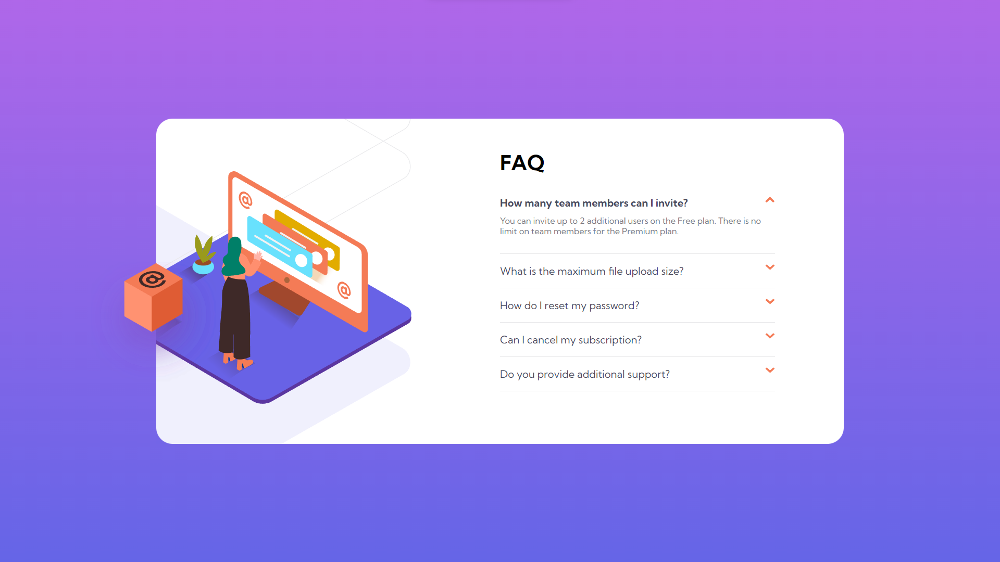

# Frontend Mentor - FAQ accordion card solution

This is a solution to the [FAQ accordion card challenge on Frontend Mentor](https://www.frontendmentor.io/challenges/faq-accordion-card-XlyjD0Oam). Frontend Mentor challenges help you improve your coding skills by building realistic projects. 

## Table of contents

- [Frontend Mentor - FAQ accordion card solution](#frontend-mentor---faq-accordion-card-solution)
  - [Table of contents](#table-of-contents)
  - [Overview](#overview)
    - [The challenge](#the-challenge)
    - [Screenshot](#screenshot)
    - [Links](#links)
  - [My process](#my-process)
    - [What I learned](#what-i-learned)
    - [Continued development](#continued-development)
    - [Useful resources](#useful-resources)
  - [Author](#author)

## Overview

### The challenge

Users should be able to:

- View the optimal layout for the component depending on their device's screen size
- See hover states for all interactive elements on the page
- Hide/Show the answer to a question when the question is clicked

### Screenshot



### Links

- Solution URL: [Frontend Mentor](https://your-solution-url.com)
- Live Site URL: [Vercel](https://your-live-site-url.com)

## My process

### What I learned

I learned how to arrange the `.hero-image-container` in a way where `overflow` is different in different screen sizes and hero images. I also learned how to code an Accordion without the use of JS.

```html
<div class="hero-image-container">
   
  
  
  <div class="no-overflow">
    
     
    
  </div>
</div>
```
```css
/* ! Hero Image */
.hero-image-container {
    grid-area: hero-image;
    position: relative;
}
.hero-image-container img {
    position: absolute;
}
.no-overflow {
    width: 100%;
    height: 100%;
    overflow: hidden;
    position: relative;
}
#pattern {
    left: -575px;
    top: -300px;
    z-index: 1;
}
#pattern-2 {
    display: none;
}
#box {
    left: -100px;
    top: 220px; 
    z-index: 3;
}
#woman {
    left: -80px;
    top: 80px; 
    z-index: 2;
}
#woman-2 {
    display: none;
}
```
### Continued development

I feel that the `.hero-image-container` could have been coded better. If you have any feedback, please let me know :)

### Useful resources

- [How To Create an Accordion with HTML & CSS](https://www.youtube.com/watch?v=fSkhTd4rpDo) -This helped me set the foundations of my HTML and CSS with creating the Accordion.
- [How To Hide Check Radio with CSS](https://stackoverflow.com/questions/18078871/hide-check-radio-button-with-css) - Quick thread on how to remove the radio check button through CSS.
- [CSS Gradient](https://cssgradient.io) - A website for generating CSS Gradients which I used for the `background`.
- [MDN Transform](https://developer.mozilla.org/en-US/docs/Web/CSS/transform  ) - MDN Documentation on how to use CSS `transform` which I used on the `#arrow-down` and flip it 180 degrees when the Accordion was `checked`.

## Author

- Website - [Justin vera](https://www.justinvera.com)
- Frontend Mentor - [@justinnvera](https://www.frontendmentor.io/profile/justinnvera)